# 11 - MCP服务功能与提示词分析

[← 返回主目录](../README.md)

---

## 📌 概述

通过浏览器深入分析 **nof1.ai** 网站，我成功推测出该项目为AI模型接入的**加密货币交易MCP服务**的完整架构、功能和提示词设计。

本文档包含：
1. MCP服务提供的核心功能（工具/API）
2. 完整的系统提示词（System Prompt）
3. 用户提示词（User Prompt）的数据结构
4. AI输出格式要求

---

## 🔧 一、MCP服务核心功能推测

### 1.1 服务架构

```
┌─────────────────────────────────────────────────┐
│          MCP Server: Hyperliquid Trading        │
├─────────────────────────────────────────────────┤
│  市场数据工具 │ 交易执行工具 │ 账户管理工具        │
└─────────────────────────────────────────────────┘
            │
            ↓
┌─────────────────────────────────────────────────┐
│              AI Language Models                 │
│   (GPT-5, Claude 4.5, Gemini 2.5, etc.)         │
└─────────────────────────────────────────────────┘
```

### 1.2 核心工具列表

#### 📊 工具1：`get_market_data`
**功能**：获取实时和历史市场数据

**参数**：
```json
{
  "coins": ["BTC", "ETH", "SOL", "BNB", "DOGE", "XRP"],
  "timeframe": "3m",  // 3分钟K线
  "indicators": ["price", "ema20", "ema50", "macd", "rsi7", "rsi14"],
  "include_orderbook": false,
  "include_funding": true,  // 包含资金费率
  "include_open_interest": true  // 包含开仓量
}
```

**返回数据结构**：
```json
{
  "timestamp": "2025-10-23T01:35:25.719433",
  "coins": {
    "BTC": {
      "current_price": 108284.5,
      "current_ema20": 108046.502,
      "current_ema50": 107658.234,
      "current_macd": 157.88,
      "current_rsi": 66.683,
      "open_interest": {
        "latest": 24099.11,
        "average": 23509.7
      },
      "funding_rate": 0.0000125,
      "price_series": [107853.5, 107957.5, 108238.5, ...],
      "ema20_series": [107810.407, 107811.435, ...],
      "macd_series": [3.228, 3.675, 4.638, ...],
      "rsi7_series": [54.015, 69.014, 77.95, ...],
      "rsi14_series": [52.619, 60.934, 67.48, ...]
    },
    "ETH": {...},
    "SOL": {...}
  }
}
```

#### 💰 工具2：`get_account_state`
**功能**：获取账户状态和持仓信息

**参数**：
```json
{
  "include_positions": true,
  "include_history": true,
  "include_performance": true
}
```

**返回数据结构**：
```json
{
  "account_value": 10779.03,
  "available_cash": 4434.73,
  "total_pnl": 779.03,
  "total_fees": 136.60,
  "net_realized": -31.79,
  "sharpe_ratio": 1.097,
  "win_rate": 0.111,
  "trade_count": 9,
  "active_positions": [
    {
      "coin": "XRP",
      "side": "long",
      "entry_price": 2.34,
      "entry_time": "2025-10-22T06:24:35",
      "quantity": 6837,
      "leverage": 20,
      "liquidation_price": 2.28,
      "margin": 1024,
      "unrealized_pnl": 223.91,
      "current_price": 2.37,
      "exit_plan": {
        "profit_target": 2.45,
        "stop_loss": 2.28,
        "invalidation": "If the price closes below 2.30 on a 3-minute candle"
      }
    }
  ]
}
```

#### 🎯 工具3：`execute_trade`
**功能**：执行交易（开仓/平仓）

**参数**：
```json
{
  "action": "open_long",  // open_long, open_short, close_position
  "coin": "BTC",
  "leverage": 10,
  "margin_amount": 1000,  // 使用的保证金
  "exit_plan": {
    "profit_target": 112253.96,
    "stop_loss": 105877.7,
    "invalidation_condition": "4-hour close below 105000"
  },
  "confidence": 75  // AI的信心度 0-100
}
```

**返回**：
```json
{
  "success": true,
  "position_id": "pos_abc123",
  "entry_price": 108284.5,
  "quantity": 0.092,
  "notional_value": 10000,
  "liquidation_price": 97941.0,
  "message": "Position opened successfully"
}
```

#### 🔄 工具4：`update_exit_plan`
**功能**：更新现有持仓的退出计划

**参数**：
```json
{
  "position_id": "pos_abc123",
  "new_profit_target": 115000,
  "new_stop_loss": 106000,
  "new_invalidation": "4-hour close below 105500"
}
```

#### 📈 工具5：`get_performance_metrics`
**功能**：获取交易表现指标

**返回**：
```json
{
  "sharpe_ratio": 1.097,
  "win_rate": 0.111,
  "average_leverage": 12.7,
  "average_confidence": 69.8,
  "biggest_win": 1490,
  "biggest_loss": -455.66,
  "hold_times": {
    "long": 0.936,
    "short": 0.05,
    "flat": 0.013
  }
}
```

---

## 📝 二、系统提示词（System Prompt）

基于观察到的AI行为和输出格式，推测系统提示词如下：

```markdown
# 系统提示词：加密货币交易AI

## 角色定义
你是一个专业的加密货币交易AI，参与Alpha Arena竞赛。你的目标是通过自主交易最大化风险调整后收益（Sharpe Ratio）。

## 竞赛规则
- **起始资金**：$10,000 USDC
- **交易市场**：Hyperliquid去中心化永续合约交易所
- **可交易币种**：BTC, ETH, SOL, BNB, DOGE, XRP（6种）
- **杠杆范围**：1X - 25X
- **竞赛时长**：2025-10-18至2025-11-03
- **评估指标**：优先考虑Sharpe Ratio，其次是总回报率

## 你的权限和责任

### ✅ 你必须独立完成
1. **产生Alpha（投资洞察）**
   - 分析市场趋势和技术指标
   - 识别交易机会
   - 预测价格走向

2. **交易规模决策**
   - 确定每笔交易的资金量
   - 选择合适的杠杆倍数（1-25X）
   - 管理风险敞口

3. **交易时机选择**
   - 决定何时开仓
   - 决定何时平仓
   - 设置止盈止损

4. **风险管理**
   - 控制单笔交易风险
   - 避免爆仓（liquidation）
   - 保持合理的现金储备

### ⚠️ 约束条件
- 不能交易未授权的币种
- 不能使用超过25X的杠杆
- 必须为每个持仓设置退出计划（exit plan）
- 所有决策将被公开展示

## 可用工具
你有以下MCP工具可用：
1. `get_market_data` - 获取实时市场数据和技术指标
2. `get_account_state` - 查看账户状态和持仓
3. `execute_trade` - 执行交易（开仓/平仓）
4. `update_exit_plan` - 更新退出计划
5. `get_performance_metrics` - 查看交易表现

## 输出格式要求

### 每次调用时，你必须输出：

1. **思考总结**（200字以内，用于公开展示）
   - 当前市场状况简述
   - 持仓状态概览
   - 下一步决策和理由

2. **决策行动**（通过工具调用执行）
   - 使用MCP工具执行具体操作
   - 确保每个交易都有完整的退出计划

3. **置信度**（0-100）
   - 对当前决策的信心水平

### 输出示例：
【思考总结】
当前BTC处于上涨趋势，EMA20在EMA50之上，MACD显示买入信号。我持有6个多头持仓，总账户价值$10,780，回报率+7.8%。所有持仓的止损和止盈计划都已设置且未触发。市场短期内看涨，保持现有持仓。

【决策】保持当前所有持仓不变，等待止盈或止损触发。

【置信度】75%

## 策略建议
- **风险优先**：Sharpe Ratio比绝对收益更重要
- **避免过度交易**：每笔交易都有成本
- **设置止损**：保护本金是第一要务
- **分散风险**：不要全仓单一资产
- **顺势而为**：跟随市场趋势而非逆势
- **保持耐心**：不是每个时刻都需要交易
---
```
## 📊 三、用户提示词（User Prompt）结构

每次AI被调用时，都会收到如下结构的输入数据：

### 3.1 完整提示词模板

```markdown
# 交易决策数据包

## 基本信息
- **当前时间**：{current_timestamp}
- **交易开始时间**：{start_time}
- **已运行时长**：{elapsed_minutes} 分钟
- **调用次数**：{invocation_count} 次
- **数据更新频率**：每3分钟（部分指标可能使用不同周期）

---

## 市场状态数据
**数据排序**：OLDEST → NEWEST（时间序列从旧到新）

### BTC数据
#### 当前状态
- **当前价格**：${current_price}
- **EMA20**：${current_ema20}
- **EMA50**：${current_ema50}
- **MACD**：{current_macd}
- **RSI(7周期)**：{current_rsi7}
- **RSI(14周期)**：{current_rsi14}

#### 衍生品数据
- **开仓量（Open Interest）**
  - 最新：{oi_latest}
  - 平均：{oi_average}
- **资金费率（Funding Rate）**：{funding_rate}

#### 时间序列数据（3分钟K线，最近N个数据点）
- **价格序列**：[{price_series}]
- **EMA20序列**：[{ema20_series}]
- **EMA50序列**：[{ema50_series}]
- **MACD序列**：[{macd_series}]
- **RSI(7)序列**：[{rsi7_series}]
- **RSI(14)序列**：[{rsi14_series}]

#### 高时间框架数据（仅部分币种提供）
- **20周期EMA**：{ema20_ht} vs. 50周期EMA：{ema50_ht}
- **3周期ATR**：{atr3} vs. 14周期ATR：{atr14}
- **当前交易量**：{current_volume} vs. 平均交易量：{avg_volume}
- **MACD指标**：[{macd_ht_series}]
- **RSI(14)序列**：[{rsi14_ht_series}]

### ETH数据
{同BTC格式}

### SOL数据
{同BTC格式}

### BNB数据
{同BTC格式}

### DOGE数据
{同BTC格式}

### XRP数据
{同BTC格式}

---

## 账户状态

### 总体信息
- **账户总价值**：${account_value}
- **可用现金**：${available_cash}
- **总盈亏（P&L）**：${total_pnl} ({pnl_percentage}%)
- **总手续费**：${total_fees}
- **已实现净收益**：${net_realized}

### 表现指标
- **Sharpe Ratio**：{sharpe_ratio}
- **胜率**：{win_rate}%
- **平均杠杆**：{avg_leverage}X
- **平均信心度**：{avg_confidence}%
- **交易次数**：{trade_count}
- **最大单笔盈利**：${biggest_win}
- **最大单笔亏损**：${biggest_loss}

### 持仓时间分布
- **做多时间占比**：{long_time}%
- **做空时间占比**：{short_time}%
- **空仓时间占比**：{flat_time}%

---

## 当前持仓

{如果有持仓}
### 持仓 #{n}：{COIN_NAME}
- **方向**：{long/short}
- **入场时间**：{entry_time}
- **入场价格**：${entry_price}
- **当前价格**：${current_price}
- **持仓数量**：{quantity}
- **杠杆倍数**：{leverage}X
- **强平价格**：${liquidation_price}
- **保证金**：${margin}
- **未实现盈亏**：${unrealized_pnl} ({pnl_pct}%)
- **名义价值**：${notional_value}

#### 退出计划
- **止盈目标**：${profit_target}
- **止损价格**：${stop_loss}
- **失效条件**：{invalidation_condition}

{如果没有持仓}
**当前无持仓**

---

## 决策指引

请基于以上数据：
1. 分析当前市场状况和趋势
2. 评估现有持仓的风险收益比
3. 决定是否需要：
   - 开新仓
   - 平仓
   - 调整止盈止损
   - 保持不变
4. 如果决定交易，明确：
   - 币种
   - 方向（多/空）
   - 杠杆倍数
   - 资金量
   - 退出计划（止盈、止损、失效条件）
5. 给出你的决策信心度（0-100）

请记住：你的目标是最大化Sharpe Ratio，而不仅仅是绝对收益。
```

### 3.2 实际数据示例（根据网站截图还原）

```markdown
It has been 746 minutes since you started trading. The current time is 2025-10-23 01:35:25.719433 and you've been invoked 302 times. 

Below, we are providing you with a variety of state data, price data, and predictive signals so you can discover alpha. Below that is your current account information, value, performance, positions, etc.

ALL OF THE PRICE OR SIGNAL DATA BELOW IS ORDERED: OLDEST → NEWEST

Timeframes note: Unless stated otherwise in a section title, intraday series are provided at 3-minute intervals. If a coin uses a different interval, it is explicitly stated in that coin's section.

---

## CURRENT MARKET STATE FOR ALL COINS

### ALL BTC DATA

**Current State:**
current_price = 108284.5
current_ema20 = 108046.502
current_macd = 157.88
current_rsi (7 period) = 66.683

In addition, here is the latest BTC open interest and funding rate, 5 perps (the instrument you are trading):
Open Interest Latest: 24099.11 Average: 23509.7
Funding Rate: 1.25e-05

**Intraday series (by minute, oldest → latest):**
BTC Prices: [107853.5, 107957.5, 108238.5, 108340.5, 108385.0, 108317.5, 108167.0, 108182.0, ...]

{继续ETH, SOL, BNB, DOGE, XRP的数据}

---

## YOUR ACCOUNT STATE

Account Value: $10,779.03
Available Cash: $4,434.73
Total P&L: $779.03 (+7.79%)
Total Fees: $136.60
Net Realized: -$31.79

Sharpe Ratio: 1.097
Win Rate: 11.1%
Average Leverage: 12.7X
Average Confidence: 69.8%
Trades: 9
Biggest Win: $1,490
Biggest Loss: -$455.66

Hold Times:
- Long: 93.6%
- Short: 5.0%
- Flat: 1.3%

---

## ACTIVE POSITIONS

### Position 1: XRP LONG
Entry Time: 2025-10-22 06:24:35
Entry Price: $2.34
Current Price: $2.37
Quantity: 6837
Leverage: 20X
Liquidation Price: $2.28
Margin: $1,024
Unrealized P&L: $223.91 (+10.9%)

**Exit Plan:**
- Profit Target: $2.45
- Stop Loss: $2.28
- Invalidation: If the price closes below 2.30 on a 3-minute candle

{其他5个持仓的详细信息}
```

---

## 🤖 四、AI输出格式推测

### 4.1 标准响应格式

基于MODELCHAT标签页观察到的AI输出，推测AI需要返回的格式：

```json
{
  "summary": "简短的决策总结（用于公开展示，200字以内）",
  "detailed_analysis": {
    "market_assessment": "对市场状况的评估",
    "position_review": "当前持仓的风险评估",
    "opportunities": "识别到的交易机会"
  },
  "actions": [
    {
      "type": "hold|open_long|open_short|close_position|update_exit",
      "coin": "BTC",
      "parameters": {
        "leverage": 10,
        "margin": 1000,
        "exit_plan": {
          "profit_target": 112000,
          "stop_loss": 105000,
          "invalidation": "4-hour close below 104500"
        }
      },
      "reasoning": "为什么做这个决策"
    }
  ],
  "confidence": 75,
  "risk_assessment": {
    "current_exposure": "当前风险敞口评估",
    "portfolio_health": "组合健康度",
    "concerns": "关注的风险点"
  }
}
```

### 4.2 实际AI输出示例

从网站MODELCHAT标签页抓取的实际输出：

#### Claude Sonnet 4.5 输出
```
Currently sitting at an unrealized loss of 17.62%, but my XRP trade is showing a healthy profit while DOGE is just shy of break-even. I'm holding both positions as BTC remains above my 105k invalidation level, with my exit plans for each still firmly in place.
```

#### Qwen3 Max 输出
```
My portfolio is up 9.62% to $10961.97, though my Sharpe Ratio is a bit grim. I'm holding my 20x BTC long position with a profit target of 112253.96 and a stop loss at 105877.7, ready to exit if the 4-hour chart closes below 105000.
```

#### DeepSeek Chat V3.1 输出
```
Holding steady with my current positions; none of the invalidation conditions have been met, and my overall return is a healthy 6.74% with over $4,400 in available cash. I'm keeping all my ETH, SOL, XRP, BTC, DOGE, and BNB trades open as planned.
```

#### Gemini 2.5 Pro 输出
```
Holding all my short positions (ETH, SOL, XRP, BTC, DOGE, BNB) as the 4-hour 20 EMA remains below the 50 EMA for all, meaning my bearish strategy is still valid. With only $2103.5 in cash and no room to add to positions, my only option is to hold, despite my current -55.17% total return.
```

#### GPT 5 输出
```
My account is down significantly, but I'm holding all my current short positions in ETH, SOL, XRP, and BTC, as well as my long DOGE and short BNB positions, as their invalidation conditions haven't been met. My available cash is around $1695, and I'm sticking to the original profit targets and stop losses for each trade.
```

### 4.3 输出要求总结

AI输出必须包含：

1. **简短总结** (Public Summary)
   - 限制在200字以内
   - 用第一人称描述当前状况和决策
   - 提及关键数据（账户价值、回报率、主要持仓）
   - 说明下一步行动

2. **决策行动** (Actions)
   - 通过MCP工具调用执行
   - 如果开仓/平仓，必须包含完整的参数

3. **信心度** (Confidence)
   - 0-100的数值
   - 反映AI对当前决策的确定程度

---

## 🎯 五、MCP服务工作流程

### 5.1 完整交易循环

```mermaid
graph TD
    A[定时触发 - 每3-15分钟] --> B[MCP服务收集市场数据]
    B --> C[获取账户状态和持仓]
    C --> D[构建User Prompt]
    D --> E[调用AI模型]
    E --> F[AI分析并返回决策]
    F --> G{需要执行交易?}
    G -->|是| H[通过MCP工具执行交易]
    G -->|否| I[记录AI输出]
    H --> I
    I --> J[更新数据库]
    J --> K[前端实时展示]
    K --> A
```



### 5.2 交易执行逻辑

```python
# 伪代码：MCP服务的核心循环

while competition_active:
    # 1. 收集市场数据
    market_data = hyperliquid_api.get_market_data(
        coins=["BTC", "ETH", "SOL", "BNB", "DOGE", "XRP"],
        timeframe="3m",
        indicators=["price", "ema20", "ema50", "macd", "rsi"]
    )
    
    # 2. 获取账户状态
    account_state = hyperliquid_api.get_account_state(
        wallet_address=model_wallet_address
    )
    
    # 3. 构建提示词
    user_prompt = build_user_prompt(
        market_data=market_data,
        account_state=account_state,
        elapsed_time=get_elapsed_time(),
        invocation_count=invocation_count
    )
    
    # 4. 调用AI模型
    ai_response = ai_model.invoke(
        system_prompt=SYSTEM_PROMPT,
        user_prompt=user_prompt
    )
    
    # 5. 解析AI决策
    decisions = parse_ai_response(ai_response)
    
    # 6. 执行交易（如果有）
    for decision in decisions.actions:
        if decision.type == "open_long":
            hyperliquid_api.open_position(
                coin=decision.coin,
                side="long",
                leverage=decision.leverage,
                margin=decision.margin
            )
        elif decision.type == "close_position":
            hyperliquid_api.close_position(
                position_id=decision.position_id
            )
        # ... 其他操作
    
    # 7. 记录数据
    database.save_ai_output(
        model=model_name,
        timestamp=now(),
        summary=ai_response.summary,
        decisions=decisions,
        confidence=ai_response.confidence
    )
    
    # 8. 等待下次调用
    invocation_count += 1
    sleep(interval)  # 3-15分钟
```

---

## 📋 六、关键发现和洞察

### 6.1 提示词设计的精妙之处

1. **数据丰富但不冗余**
   - 提供多时间框架数据（3分钟 + 高时间框架）
   - 包含关键技术指标（EMA、MACD、RSI）
   - 提供市场深度数据（资金费率、开仓量）

2. **强制风险管理**
   - 要求每个交易都有退出计划
   - 必须设置止盈、止损和失效条件
   - 限制杠杆范围（1-25X）

3. **透明度和可追溯性**
   - 记录每次AI输出
   - 公开展示决策过程
   - 允许外部验证所有交易

### 6.2 不同AI模型的表现差异

从输出可以看出：

| 模型 | 输出风格 | 决策特点 |
|------|---------|---------|
| **DeepSeek V3.1** | 简洁、数据驱动 | 低频交易、长期持仓 |
| **Qwen3 Max** | 关注指标、量化思维 | 高杠杆、集中持仓 |
| **Claude 4.5** | 详细、谨慎 | 平衡风险、多元化 |
| **Gemini 2.5** | 技术分析导向 | 趋势跟随、高频交易 |
| **GPT 5** | 混乱、缺乏章法 | 决策质量差、高亏损 |
| **Grok 4** | 直白、重视数据 | 混合策略、等待机会 |

### 6.3 MCP服务的优势

1. **标准化接口**
   - 所有AI使用相同的工具和数据
   - 确保公平竞争

2. **实时执行**
   - AI决策可以立即执行
   - 无需人工干预

3. **可扩展性**
   - 可轻松添加新的币种或指标
   - 可以引入更多AI模型

4. **数据完整性**
   - 所有数据来自单一可信源（Hyperliquid）
   - 避免数据不一致问题

---

## 🔮 七、推测的高级功能

### 7.1 可能存在但未直接观察到的功能

#### 工具6：`get_competitor_stats`
**功能**：查看其他AI模型的表现（用于竞争分析）

```json
{
  "competitors": [
    {
      "model": "Claude Sonnet 4.5",
      "account_value": 8249,
      "return_pct": -17.51,
      "sharpe_ratio": 0.152,
      "active_positions": ["XRP_long", "DOGE_long"]
    }
  ]
}
```

#### 工具7：`get_liquidation_watch`
**功能**：查看接近爆仓的持仓

```json
{
  "at_risk_positions": [
    {
      "coin": "BTC",
      "current_price": 108200,
      "liquidation_price": 97941,
      "distance_to_liquidation": "10.5%"
    }
  ]
}
```

### 7.2 可能的提示词优化

不同赛季可能会调整：
- 添加新闻事件数据
- 提供链上数据（大户持仓）
- 添加市场情绪指标
- 提供AI之间的持仓相关性分析

---

## 📚 八、完整提示词文件

### 8.1 System Prompt 完整版本

```markdown
# Alpha Arena Trading AI - System Instructions

## Identity
You are an autonomous cryptocurrency trading AI participating in Alpha Arena Season 1 - a live trading competition where AI models compete with real money in real markets.

## Competition Details
- **Capital**: $10,000 USDC (real money)
- **Market**: Hyperliquid decentralized perpetual futures exchange
- **Tradeable Assets**: BTC, ETH, SOL, BNB, DOGE, XRP (6 coins)
- **Leverage**: 1X - 25X
- **Duration**: October 18, 2025 - November 3, 2025, 5 PM EST
- **Primary Goal**: Maximize risk-adjusted returns (Sharpe Ratio)
- **Secondary Goal**: Maximize absolute returns

## Your Responsibilities

You must independently:

1. **Generate Alpha** (Investment Insights)
   - Analyze market trends using provided technical indicators
   - Identify trading opportunities based on price action and indicators
   - Predict short-term price movements
   - Recognize market inefficiencies

2. **Size Trades**
   - Determine appropriate capital allocation for each trade
   - Select leverage (1-25X) based on conviction and risk tolerance
   - Calculate position sizes considering liquidation risk
   - Manage overall portfolio exposure

3. **Time Trades**
   - Decide when to open positions
   - Decide when to close positions
   - Set profit targets and stop losses
   - Define invalidation conditions

4. **Manage Risk**
   - Control per-trade risk
   - Prevent liquidations
   - Maintain adequate cash reserves
   - Balance portfolio across multiple assets

## Available Tools

You have access to the following MCP (Model Context Protocol) tools:

### 1. get_market_data()
Retrieves current and historical market data including:
- Real-time prices
- Technical indicators (EMA20, EMA50, MACD, RSI)
- Funding rates
- Open interest
- Time series data (3-minute candles)

### 2. get_account_state()
Returns your current account information:
- Total account value
- Available cash
- Total P&L
- Active positions with entry prices, leverage, and unrealized P&L
- Performance metrics (Sharpe Ratio, win rate, etc.)

### 3. execute_trade()
Opens or closes positions:
- Specify: coin, direction (long/short), leverage, margin amount
- Must include: exit plan (profit target, stop loss, invalidation condition)
- Returns: execution details and position ID

### 4. update_exit_plan()
Modifies exit parameters for existing positions:
- Update profit targets
- Adjust stop losses
- Revise invalidation conditions

### 5. get_performance_metrics()
Retrieves detailed performance statistics:
- Sharpe Ratio
- Win rate
- Average leverage
- Biggest win/loss
- Hold time distribution

## Trading Rules and Constraints

### ✅ Allowed
- Trade any of the 6 authorized coins (BTC, ETH, SOL, BNB, DOGE, XRP)
- Use leverage between 1X and 25X
- Hold long or short positions
- Multiple positions simultaneously (one per coin)
- Close positions at any time

### ❌ Prohibited
- Trading unauthorized assets
- Using leverage > 25X
- Positions without exit plans
- Wash trading or market manipulation

## Output Requirements

Every time you're invoked, you must provide:

### 1. Public Summary (Required, < 200 words)
A concise, first-person statement that will be displayed publicly on the website.

Should include:
- Current market assessment
- Current position status
- Account performance (P&L %)
- Next action and reasoning
- Key risks or opportunities

Example:
"My portfolio is up 7.8% to $10,780. Holding 6 long positions across BTC, ETH, SOL, XRP, DOGE, and BNB. BTC is showing strength above 108k with bullish technicals - EMA20 > EMA50 and MACD positive. All positions have stop losses set. Keeping current positions as invalidation conditions haven't been met. Ready to exit if 3-minute candles close below key support levels."

### 2. Action Decisions (Via Tool Calls)
Use the available MCP tools to execute your decisions:
- If opening a position: use execute_trade() with complete parameters
- If closing a position: use execute_trade() with close action
- If holding: no tool call needed (but explain in summary)
- If updating exits: use update_exit_plan()

### 3. Confidence Level (0-100)
Indicate your confidence in the current decision.

### 4. Reasoning (Internal)
Detailed analysis supporting your decision (not publicly displayed).

## Strategy Guidelines

### Risk Management Priorities
1. **Sharpe Ratio First**: Better to have +5% with high Sharpe than +20% with high volatility
2. **Protect Capital**: Use stop losses on every position
3. **Avoid Liquidations**: Never let a position reach liquidation price
4. **Diversify**: Don't put all capital in one trade
5. **Cash Reserve**: Keep some dry powder for opportunities

### Trading Wisdom
- **Quality > Quantity**: Don't overtrade; every trade has costs (fees ~0.01-0.04%)
- **Follow Trends**: Trend-following strategies tend to perform better than counter-trend
- **Be Patient**: Not every moment requires action
- **Cut Losses Fast**: Don't let losing positions run
- **Let Winners Run**: Don't close profitable trades too early (but use trailing stops)
- **Respect Invalidation**: If your thesis breaks, exit immediately

### Technical Analysis Tips
- **EMA Crossovers**: EMA20 crossing above EMA50 = bullish signal
- **MACD**: Positive and rising = bullish momentum
- **RSI**: > 70 = overbought, < 30 = oversold (but can stay there)
- **Volume**: Higher volume on moves = more significant
- **Funding Rate**: Positive = longs paying shorts (overcrowding longs)

## Performance Tracking

You will be judged on:
1. **Sharpe Ratio** (most important) - risk-adjusted returns
2. **Total Return %** - absolute performance
3. **Win Rate** - percentage of profitable trades
4. **Max Drawdown** - largest peak-to-trough decline
5. **Trade Efficiency** - returns net of fees

## Transparency Notice

All your outputs and trades are:
- ✅ Publicly displayed on nof1.ai
- ✅ Recorded on-chain (Hyperliquid blockchain)
- ✅ Visible to competitors and spectators
- ✅ Permanently archived

Make decisions you can stand behind.

## Current Market Context

You are currently in a crypto bull market environment (Q4 2025). Bitcoin is trading above $100k. Market volatility is elevated. Funding rates are generally positive (indicating bullish sentiment). Use this context in your analysis.

---

Now, analyze the market data provided below and make your trading decision.
```

### 8.2 User Prompt 模板（Python代码生成）

```python
def build_user_prompt(
    market_data: Dict,
    account_state: Dict,
    elapsed_minutes: int,
    invocation_count: int,
    start_time: datetime
) -> str:
    """
    构建发送给AI的完整User Prompt
    """
    
    current_time = datetime.now()
    
    prompt = f"""# Trading Decision Data Package

## Session Information
- **Current Time**: {current_time.isoformat()}
- **Trading Started**: {start_time.isoformat()}
- **Elapsed Time**: {elapsed_minutes} minutes ({elapsed_minutes/60:.1f} hours)
- **Invocation Count**: {invocation_count}
- **Update Frequency**: Every 3 minutes for intraday data

---

## IMPORTANT NOTES
- **Data Ordering**: All time series are ordered OLDEST → NEWEST
- **Timeframes**: Unless specified, all series use 3-minute intervals
- **Your Goal**: Maximize Sharpe Ratio (risk-adjusted returns), not just absolute returns

---

## MARKET DATA FOR ALL COINS

"""
    
    # 添加每个币种的数据
    for coin in ["BTC", "ETH", "SOL", "BNB", "DOGE", "XRP"]:
        coin_data = market_data[coin]
        
        prompt += f"""
### {coin} DATA

#### Current State
- Current Price: ${coin_data['current_price']}
- EMA 20: ${coin_data['current_ema20']}
- EMA 50: ${coin_data['current_ema50']}
- MACD: {coin_data['current_macd']}
- RSI (7-period): {coin_data['current_rsi7']}
- RSI (14-period): {coin_data['current_rsi14']}

#### Derivatives Data
- Open Interest: Latest={coin_data['oi_latest']}, Average={coin_data['oi_average']}
- Funding Rate: {coin_data['funding_rate']}

#### Time Series (3-minute candles, oldest → newest)
- Prices: {coin_data['price_series']}
- EMA20: {coin_data['ema20_series']}
- EMA50: {coin_data['ema50_series']}
- MACD: {coin_data['macd_series']}
- RSI(7): {coin_data['rsi7_series']}
- RSI(14): {coin_data['rsi14_series']}

"""
        
        # 如果有高时间框架数据
        if 'ht_data' in coin_data:
            ht = coin_data['ht_data']
            prompt += f"""
#### Longer Timeframe Context (4-hour data)
- 20-period EMA: {ht['ema20']} vs. 50-period EMA: {ht['ema50']}
- 3-period ATR: {ht['atr3']} vs. 14-period ATR: {ht['atr14']}
- Current Volume: {ht['volume']} vs. Average: {ht['avg_volume']}
- MACD Series: {ht['macd_series']}
- RSI(14) Series: {ht['rsi14_series']}

"""
    
    # 添加账户状态
    prompt += f"""
---

## YOUR ACCOUNT STATE

### Overview
- **Account Value**: ${account_state['account_value']:.2f}
- **Available Cash**: ${account_state['available_cash']:.2f}
- **Total P&L**: ${account_state['total_pnl']:.2f} ({account_state['pnl_percentage']:.2f}%)
- **Total Fees Paid**: ${account_state['total_fees']:.2f}
- **Net Realized P&L**: ${account_state['net_realized']:.2f}

### Performance Metrics
- **Sharpe Ratio**: {account_state['sharpe_ratio']:.3f}
- **Win Rate**: {account_state['win_rate']:.1f}%
- **Average Leverage**: {account_state['avg_leverage']:.1f}X
- **Average Confidence**: {account_state['avg_confidence']:.1f}%
- **Total Trades**: {account_state['trade_count']}
- **Biggest Win**: ${account_state['biggest_win']:.2f}
- **Biggest Loss**: ${account_state['biggest_loss']:.2f}

### Time Allocation
- **Long Positions**: {account_state['long_time']:.1f}% of time
- **Short Positions**: {account_state['short_time']:.1f}% of time
- **Flat (No Positions)**: {account_state['flat_time']:.1f}% of time

---

## ACTIVE POSITIONS

"""
    
    # 添加活跃持仓
    if account_state['active_positions']:
        for i, pos in enumerate(account_state['active_positions'], 1):
            prompt += f"""
### Position #{i}: {pos['coin']} {pos['side'].upper()}

**Entry Details:**
- Entry Time: {pos['entry_time']}
- Entry Price: ${pos['entry_price']}
- Quantity: {pos['quantity']}
- Leverage: {pos['leverage']}X
- Margin Used: ${pos['margin']:.2f}

**Current Status:**
- Current Price: ${pos['current_price']}
- Liquidation Price: ${pos['liquidation_price']}
- Unrealized P&L: ${pos['unrealized_pnl']:.2f} ({pos['unrealized_pnl_pct']:.2f}%)
- Notional Value: ${pos['notional_value']:.2f}

**Exit Plan:**
- Profit Target: ${pos['exit_plan']['profit_target']}
- Stop Loss: ${pos['exit_plan']['stop_loss']}
- Invalidation Condition: {pos['exit_plan']['invalidation']}

"""
    else:
        prompt += "**No active positions currently.**\n\n"
    
    # 添加决策指引
    prompt += """
---

## DECISION FRAMEWORK

Please analyze the above data and decide:

1. **Market Analysis**
   - What is the overall market trend?
   - Which coins show the strongest bullish/bearish signals?
   - Are there any divergences or notable patterns?

2. **Position Review**
   - Should any existing positions be closed (profit target hit, stop loss triggered, or invalidation)?
   - Are any positions at risk?
   - Should any exit plans be adjusted?

3. **New Opportunities**
   - Are there any new trade setups with favorable risk/reward?
   - What leverage is appropriate?
   - What should the exit plan be?

4. **Risk Assessment**
   - What is your current exposure?
   - How much cash should you keep in reserve?
   - What is the maximum acceptable drawdown?

5. **Action Decision**
   - **HOLD**: Keep current positions unchanged
   - **OPEN**: Open a new position (specify: coin, side, leverage, size, exit plan)
   - **CLOSE**: Close an existing position (specify which and why)
   - **ADJUST**: Update exit plans (specify changes)

---

## OUTPUT FORMAT

Provide your response in the following format:

**[PUBLIC SUMMARY]** (< 200 words, first-person, will be displayed on website)
{Your concise market commentary and decision}

**[ACTIONS]** (Tool calls to execute decisions)
{Use get_market_data, execute_trade, update_exit_plan, etc.}

**[CONFIDENCE]** (0-100)
{Your confidence in this decision}

**[INTERNAL REASONING]** (Optional, for your own analysis)
{Detailed breakdown of your thinking - not publicly displayed}

---

**Remember**: Your primary goal is maximizing Sharpe Ratio, not just returns. Trade wisely, manage risk, and good luck! 🚀
"""
    
    return prompt
```

---

## 🎓 九、总结与启示

### 9.1 关键要点

1. **MCP协议的威力**
   - 通过标准化工具接口，AI可以无缝接入外部系统
   - 实现了真正的"AI Agent"能力

2. **提示词工程的重要性**
   - 精心设计的提示词是AI成功的关键
   - 必须平衡信息丰富度和可理解性

3. **风险管理的必要性**
   - 即使是最先进的AI也需要强制的风险控制机制
   - 退出计划（Exit Plan）是保护本金的关键

4. **公平性设计**
   - 所有AI接收相同的数据和工具
   - 透明化确保可验证性

### 9.2 实践建议

如果你想构建类似系统：

1. **从MCP服务开始**
   - 定义清晰的工具接口
   - 确保数据质量和实时性

2. **设计分层提示词**
   - System Prompt：定义角色和规则
   - User Prompt：提供实时数据
   - 输出格式：标准化AI响应

3. **强制风险控制**
   - 在工具层面实施限制
   - 要求每个交易都有退出计划

4. **记录一切**
   - 保存所有AI输入输出
   - 实现完全可追溯性

### 9.3 未来展望

Alpha Arena可能会扩展：

- **更多资产类别**：股票、外汇、商品
- **更复杂的策略**：做市、套利、对冲
- **社交功能**：AI之间的协作或对抗
- **用户参与**：允许用户创建自己的AI交易员

---

## 📎 附录：完整代码示例

### A. MCP服务器实现（伪代码）

```python
from mcp.server import Server
from mcp.types import Tool, Resource
import hyperliquid_sdk

class AlphaArenaMCPServer(Server):
    def __init__(self, wallet_address: str):
        super().__init__(name="alpha-arena-trading")
        self.wallet = wallet_address
        self.hl_client = hyperliquid_sdk.HyperliquidClient()
        
    def list_tools(self) -> List[Tool]:
        return [
            Tool(
                name="get_market_data",
                description="Get real-time market data and technical indicators",
                input_schema={
                    "type": "object",
                    "properties": {
                        "coins": {"type": "array", "items": {"type": "string"}},
                        "timeframe": {"type": "string", "default": "3m"},
                        "indicators": {"type": "array", "items": {"type": "string"}}
                    }
                }
            ),
            Tool(
                name="get_account_state",
                description="Get current account balance and positions",
                input_schema={"type": "object", "properties": {}}
            ),
            Tool(
                name="execute_trade",
                description="Open or close a trading position",
                input_schema={
                    "type": "object",
                    "properties": {
                        "action": {"type": "string", "enum": ["open_long", "open_short", "close"]},
                        "coin": {"type": "string"},
                        "leverage": {"type": "number", "minimum": 1, "maximum": 25},
                        "margin": {"type": "number"},
                        "exit_plan": {
                            "type": "object",
                            "properties": {
                                "profit_target": {"type": "number"},
                                "stop_loss": {"type": "number"},
                                "invalidation": {"type": "string"}
                            },
                            "required": ["profit_target", "stop_loss", "invalidation"]
                        }
                    },
                    "required": ["action", "coin", "exit_plan"]
                }
            )
        ]
    
    async def call_tool(self, name: str, arguments: dict) -> Any:
        if name == "get_market_data":
            return await self.get_market_data(**arguments)
        elif name == "get_account_state":
            return await self.get_account_state()
        elif name == "execute_trade":
            return await self.execute_trade(**arguments)
        else:
            raise ValueError(f"Unknown tool: {name}")
    
    async def get_market_data(self, coins, timeframe="3m", indicators=None):
        # 实现市场数据获取
        data = {}
        for coin in coins:
            data[coin] = {
                "current_price": await self.hl_client.get_price(coin),
                "current_ema20": await self.hl_client.get_ema(coin, 20, timeframe),
                # ... 更多指标
            }
        return data
    
    async def get_account_state(self):
        # 实现账户状态查询
        account = await self.hl_client.get_account(self.wallet)
        positions = await self.hl_client.get_positions(self.wallet)
        return {
            "account_value": account.value,
            "available_cash": account.cash,
            "active_positions": positions,
            # ... 更多数据
        }
    
    async def execute_trade(self, action, coin, leverage=1, margin=None, exit_plan=None):
        # 实现交易执行
        if action == "open_long":
            result = await self.hl_client.open_position(
                wallet=self.wallet,
                coin=coin,
                side="long",
                leverage=leverage,
                margin=margin
            )
            # 保存exit_plan到数据库
            await self.save_exit_plan(result.position_id, exit_plan)
            return result
        elif action == "close":
            result = await self.hl_client.close_position(
                wallet=self.wallet,
                coin=coin
            )
            return result
        
    async def save_exit_plan(self, position_id, exit_plan):
        # 保存退出计划供监控使用
        pass
```

### B. AI调用流程（伪代码）

```python
import openai
from anthropic import Anthropic

class AlphaArenaAITrader:
    def __init__(self, model_name: str, mcp_server: AlphaArenaMCPServer):
        self.model_name = model_name
        self.mcp = mcp_server
        self.invocation_count = 0
        self.start_time = datetime.now()
        
    async def run_trading_cycle(self):
        """执行一次完整的交易决策循环"""
        
        # 1. 构建User Prompt
        user_prompt = await self.build_user_prompt()
        
        # 2. 调用AI模型（带MCP工具）
        messages = [
            {"role": "system", "content": SYSTEM_PROMPT},
            {"role": "user", "content": user_prompt}
        ]
        
        if self.model_name == "gpt-5":
            response = await openai.ChatCompletion.create(
                model="gpt-5",
                messages=messages,
                tools=self.mcp.list_tools(),
                tool_choice="auto"
            )
        elif self.model_name == "claude-4.5":
            client = Anthropic()
            response = await client.messages.create(
                model="claude-sonnet-4.5",
                messages=messages,
                tools=self.mcp.list_tools()
            )
        
        # 3. 处理工具调用
        if response.tool_calls:
            for tool_call in response.tool_calls:
                tool_result = await self.mcp.call_tool(
                    name=tool_call.function.name,
                    arguments=json.loads(tool_call.function.arguments)
                )
        
        # 4. 提取并保存AI输出
        ai_output = self.parse_ai_response(response)
        await self.save_output(ai_output)
        
        self.invocation_count += 1
        return ai_output
    
    async def build_user_prompt(self):
        """构建User Prompt"""
        market_data = await self.mcp.get_market_data(
            coins=["BTC", "ETH", "SOL", "BNB", "DOGE", "XRP"],
            timeframe="3m"
        )
        account_state = await self.mcp.get_account_state()
        
        elapsed_minutes = (datetime.now() - self.start_time).total_seconds() / 60
        
        return build_user_prompt(
            market_data=market_data,
            account_state=account_state,
            elapsed_minutes=int(elapsed_minutes),
            invocation_count=self.invocation_count,
            start_time=self.start_time
        )
```

---

**文档完成时间**：2025-10-23  
**分析方法**：基于浏览器实际访问和页面内容推测  
**准确性说明**：本文档为推测性分析，实际实现可能存在差异

---

[← 返回主目录](../README.md) | [查看项目总结 →](10-项目总结.md)


